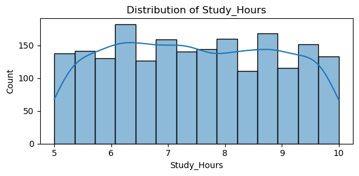
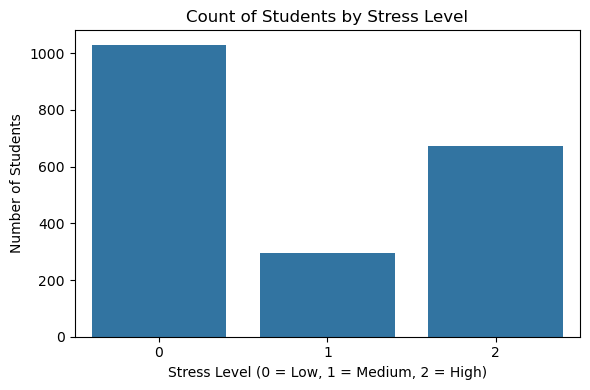
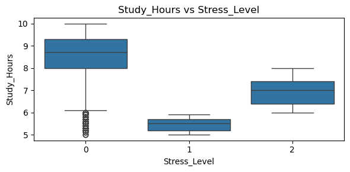
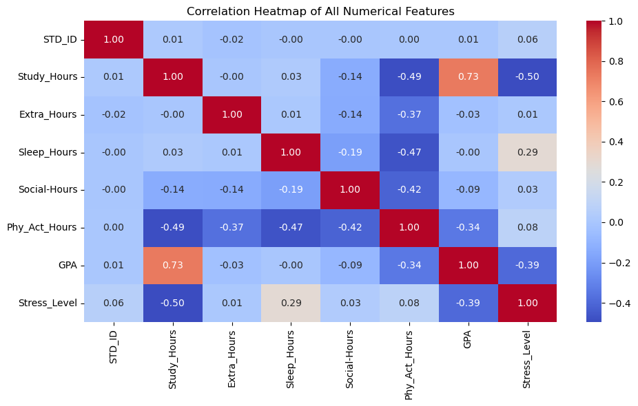

# Student_Lifestyle_Dataset Project
---

# ***🧠 Stress Level Detection Using Machine Learning***

This project is designed to detect stress levels based on various physiological features using a Support Vector Machine (SVM) model. It includes data analysis, preprocessing, model training, saving with Pickle, and GUI deployment using Streamlit.

---
# ** Support Vector Machine (SVM):**

SVM (Support Vector Machine) is a supervised machine learning algorithm that is widely used for classification problems. It finds the best boundary (hyperplane) that separates different classes.

## 📁 ***Project Workflow***

The project follows a structured and clean machine learning pipeline:

### ✅ **Step 1: Data Collection & Understanding**

The dataset is loaded using a class-based system.

Preliminary understanding via head(), info(), shape, and checking for null values.

### ✅**Step 2: Data Preprocessing & EDA**

Missing values handled.

Label Encoding for categorical values.

Exploratory Data Analysis (EDA) includes Univariate and Bivariate analysis using custom classes.

### **✅ Step 3: Data Splitting**

Features (X) and target (y) separated.

Split into training and testing using train_test_split().

### **✅ Step 4: Model Training (SVM)**

Used SVC() from scikit-learn.

Trained the model on the training data.

---

✅ **Model Evaluation and Accuracy**

Once the SVM model was trained, its performance was evaluated using:

Train Accuracy: 97.50%

Test Accuracy: 100.00%

Cross-Validation Accuracy: 96.67% (Average over 5 folds)

📌 Although the model achieved 100% accuracy on the test data, this does not necessarily mean it's perfect. To confirm generalization and avoid overfitting, we used cross-validation, which gave a realistic average accuracy of 96.67%.
This shows that the model performs consistently well across different splits of the data.

> **Note:** 

The model achieved 100% accuracy on the test data, which might be a sign of overfitting. However, since the cross-validation score is also strong (average ~96.67%), it indicates that the model is generalizing well.

---

### **✅ Step 5: Model Saving**

Saved using Python's pickle library as:
📦 svm_stress_model_pkl

---

### **📊 Graphs Used in the Project**

1. *📈 Histogram (sns.histplot)*

**Purpose:** To show the distribution of a single feature.

**Why It Matters:** Helps in understanding skewness, normality, and spread of the data.

**Used In:** Univariate analysis.

✅ The following visualizations are taken directly from the project analysis using the student stress dataset.

2.  *📊 Countplot (sns.countplot)*

**Purpose:** To show counts of each class/category.

**Why It Matters:** Helps in visualizing class imbalance for the target variable Stress_Level.

**Used In:** Univariate analysis.

✅ The following visualizations are taken directly from the project analysis using the student stress dataset.

3. *📦 Boxplot (sns.boxplot)*

**Purpose:** To show how each numeric feature varies with Stress_Level.

**Why It Matters:**  Helps identify outliers, medians, and data distributions for each stress level class.

**Used In:** Bivariate analysis.

✅ The following visualizations are taken directly from the project analysis using the student stress dataset.

1. *📊 Correlation Heatmap (sns.heatmap)*

**Purpose:** To display the correlation between all numerical features using colors.

**Why It Matters:**

- It helps identify which variables are positively or negatively related to each other. For example:

- A strong positive correlation (close to +1) means that as one feature increases, the other tends to increase.

- A negative correlation (close to -1) means that as one increases, the other decreases.

- Zero correlation means no linear relationship.

**Used In:** Bivariate analysis

✅ The following visualizations are taken directly from the project analysis using the student stress dataset.

---

### **💾 Model Saving**

After training, the model is saved using Pickle:

import pickle
pickle.dump(model, open('svm_stress_model_pkl', 'wb'))

---

## 🛠️ **Technologies Used**

| Tool / Library      | Purpose                      |
|---------------------|------------------------------|
| Python              | Core programming language    |
| Pandas / NumPy      | Data manipulation            |
| Seaborn / Matplotlib| Data visualization           |
| Scikit-learn        | ML model & preprocessing     |
| Pickle              | Model saving                 |
| Streamlit           | GUI/web deployment           |
